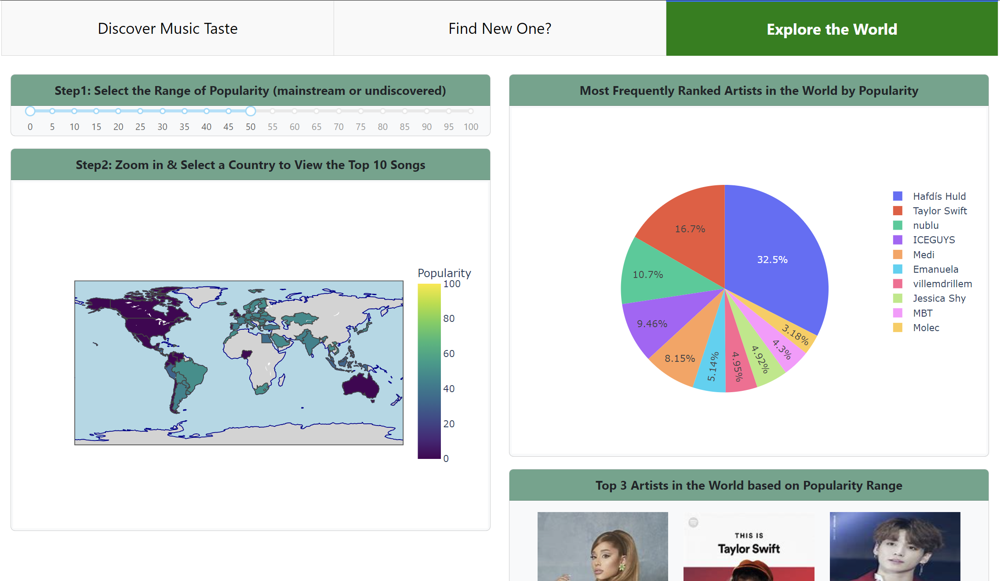

    
    <h1>Music Explorer with Spotify</h1>

## Overview

Music Explorer with Spotify uses Spotify data to provide an interactive and insightful exploration of your music preferences. Designed to help users uncover new tracks and understand their listening habits, the dashboard features advanced data visualizations and customizable filters.  

[Go to Music Explorer with Spotify Dashboard](https://spotify-dashboard-xnjm.onrender.com/)  

## Getting Started

- **Installation**: Clone the repository and install dependencies using `pip install -r requirements.txt`.
- **Launching**: Run the dashboard by executing `python dashboard_spotify_alltabs.py` and navigate to `http://127.0.0.1:8050/` in your web browser.

## Dashboard Features

### Tab 1: Discover Music Taste

- **Slicers**: Understand your music taste with filters for attributes like popularity, danceability, and tempo.
- **Dropdown Filters**: Quickly search for artists and songs with a text input field, enhancing your discovery process.
- **Radar Chart**: Visualize your music taste across different audio features, helping to identify your preferred genres and styles.
- **Genre Pie Charts**: See the distribution of genres within your listening history and explore unfamiliar musical territories.

### Tab 2: Find New Music

This tab is dedicated to finding new music based on your listening preferences and exploration of different musical features.

- **Feature Sliders**: Customize your search with sliders for various musical attributes.
- **Genre Dropdown**: Filter songs by genre to discover music that aligns with your tastes.
- **Music Visualizations**: Use parallel coordinates plots to understand the musical features of your favorite tracks.
- **Ranked Song Suggestion**: Get ranked song suggestions and Spotify link based on the genre and music features selected.

### Tab 3: Explore the World

Gain global insights into Spotify's music trends.

- **Choropleth Map**: Explore the popularity of top songs across different countries to discover new music in uncharted areas.
- **Top Songs and Artists Charts**: Discover the most popular songs and artists in the world or select a specific country.
- **Detailed Song Insights**: Adjust the range of popularity (mainstream or undiscovered), zoom in and click on a country to see the top 10 songs in that region.

## Contributing

We welcome contributions! If you have ideas for new features or improvements, please fork the repository and submit a pull request.

Example sketch:  

   

Release 1.0.0:  
Tab 1: Discovery Music Taste Sketch    
  

Tab 2: Find New Music  
  

Tab 3: Explore the World  
  
